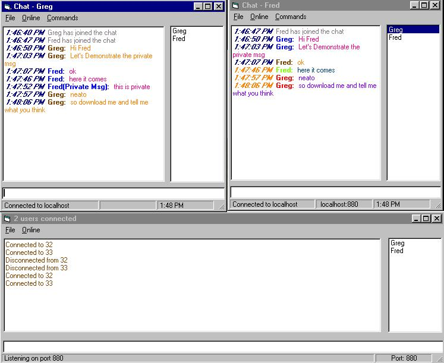



## Multi\-Connection Chat \- update

### Description

Now there is support for security, forcing all users to log in to the server. The usernames and passwords are stored in a DB at the server site, and the clients are then authenticated. ---> This is a multi connection chat using winsock. It supports multi-user, coloured chat windows, private messages, and will even display all the tasks running on another clients PC (but you'll have to look in the code for the command =). Each client displays the entry and exit of other clients, as well as maintaining a listbox of current users. Also included is a mIRC like entry box where you can use the up and down arrows to access recent commands. Please leave any suggestions.
 
### More Info
 

             |
---                |---
**Submitted On**   |2000-07-18 13:25:50
**By**             |[VB Man](https://github.com/Planet-Source-Code/PSCIndex/blob/master/ByAuthor/vb-man.md)
**Level**          |Intermediate
**User Rating**    |4.8 (53 globes from 11 users)
**Compatibility**  |VB 3\.0, VB 4\.0 \(16\-bit\), VB 4\.0 \(32\-bit\), VB 5\.0, VB 6\.0, VB Script, ASP \(Active Server Pages\) 
**Category**       |[Complete Applications](https://github.com/Planet-Source-Code/PSCIndex/blob/master/ByCategory/complete-applications__1-27.md)
**World**          |[Visual Basic](https://github.com/Planet-Source-Code/PSCIndex/blob/master/ByWorld/visual-basic.md)
**Archive File**   |[CODE\_UPLOAD78987182000\.zip](https://github.com/Planet-Source-Code/vb-man-multi-connection-chat-update__1-9863/archive/master.zip)

